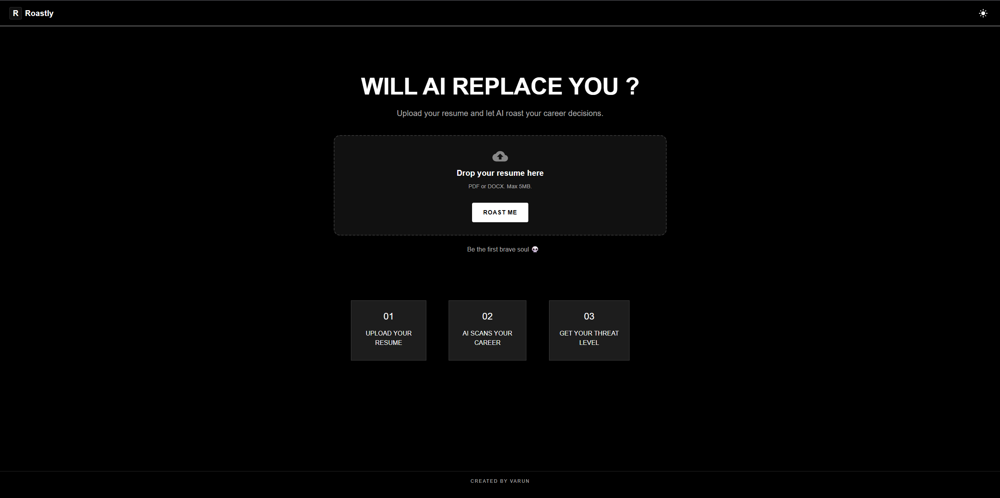

# 🔥 Roastly

> **Upload your resume. Let AI roast your career.**

Roastly is an AI-powered resume analyzer that predicts how vulnerable your career is to AI replacement. It parses your resume, evaluates your experience, skills, and projects, and delivers a brutally honest (but humorous) roast along with an AI Replacement Score.

🌐 **Live Demo:** https://resume-roaster-nu.vercel.app/

---

## ✨ Features

- 📄 Upload PDF and DOCX resumes
- 🤖 AI-powered resume parsing
- 🔥 Funny yet insightful AI career roasting
- 📊 AI Replacement Score (0–10)
- 🎯 Skill-wise analysis and scoring
- 💡 Personalized survival tips
- ⚡ Multi-provider AI fallback (Groq → Gemini → OpenAI)
- 📱 Responsive Material UI interface
- 🌙 Dark & Light theme support
- 📤 Share results on X and LinkedIn

---

## 🛠️ Tech Stack

### Frontend

- React
- Vite
- Material UI
- React Query
- Axios

### Backend

- FastAPI
- SQLAlchemy
- Alembic
- PostgreSQL (Neon)
- Pydantic

### AI Providers

- Groq
- Google Gemini
- OpenAI

### Deployment

- Frontend → Vercel
- Backend → Render
- Database → Neon PostgreSQL

---

## 🧠 How It Works

```text
Resume Upload
      │
      ▼
Resume Parser
      │
      ▼
Structured Resume
      │
      ▼
Resume Roaster
      │
      ▼
AI Roast + Score
```

### AI Provider Architecture

Roastly automatically falls back to another provider if one becomes unavailable.

```text
generate_response()
        │
 ┌──────┼───────────┐
 │      │           │
Groq  Gemini    OpenAI
```

This makes the application more reliable by handling provider outages, rate limits, and temporary API failures gracefully.

---

## 📂 Project Structure

```text
resume-roaster/
│
├── frontend/
│   ├── public/
│   ├── src/
│   ├── package.json
│   └── vite.config.js
│
├── backend/
│   ├── app/
│   │   ├── agents/
│   │   ├── ai/
│   │   ├── config/
│   │   ├── models/
│   │   ├── routes/
│   │   ├── services/
│   │   └── utils/
│   │
│   ├── alembic/
│   ├── uploads/
│   ├── requirements.txt
│   └── .env
│
└── README.md
```

---

# 🚀 Getting Started

## Clone the repository

```bash
git clone https://github.com/<your-username>/resume-roaster.git

cd resume-roaster
```

---

## Frontend Setup

```bash
cd frontend

npm install

npm run dev
```

Frontend runs at:

```text
http://localhost:5173
```

---

## Backend Setup

Create a virtual environment

```bash
cd backend

python -m venv .venv
```

Activate it

### Windows

```bash
.venv\Scripts\activate
```

### macOS/Linux

```bash
source .venv/bin/activate
```

Install dependencies

```bash
pip install -r requirements.txt
```

---

## Configure Environment Variables

Create a `.env` file inside the backend folder.

```env
DATABASE_URL=your_neon_postgres_connection_string

OPENAI_API_KEY=your_openai_api_key

GROQ_API_KEY=your_groq_api_key

GEMINI_API_KEY=your_gemini_api_key

AI_PROVIDER_ORDER=groq,gemini,openai
```

---

## Run Database Migrations

```bash
alembic upgrade head
```

---

## Start Backend

```bash
uvicorn app.main:app --reload
```

Backend runs at:

```text
http://localhost:8000
```

---

## 📸 Screenshots

> Add screenshots of:

- Landing Page


- Resume Upload


- AI Roast Result


---

## 👨‍💻 Author

**Varun Sharma**

Frontend Developer | React | FastAPI | AI Enthusiast

GitHub: https://github.com/Varun1398

LinkedIn: https://www.linkedin.com/in/varunsharma1398/

---

## ⭐ Show Your Support

If you found this project interesting or useful, consider giving it a **⭐ Star** on GitHub.

It helps others discover the project and motivates future improvements.

---
